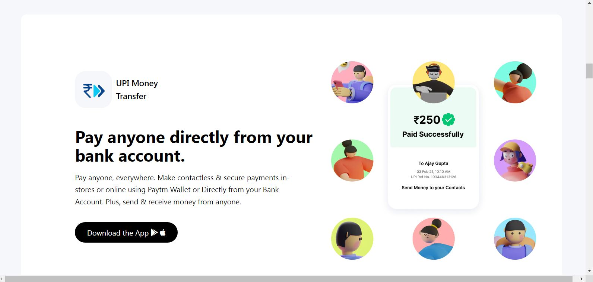

# Paytm website Clone

- This is a Paytm website clone made using tailwind css

# I'm Raj Ratan
I've been Working on this assigments that has been given by our mentor [Hitesh Choudhary](https://github.com/hiteshchoudhary)</b> 

## Built with

- HTML5
- Tailwind CSS

## What I learned
- I learned how to arrange components with tailwind css.
- I now have a strong understanding of tailwind CSS classes after completing this Project. Tailwind CSS makes life much easier.

## Time taken
- It took me around `` 3 Days ``

## Links
- [Live demo](https://pytmclone.netlify.app/)
- [Source](https://github.com/rajratan41/Paytm-Clone)

## Contact me
- GitHub - [@rajratan41](https://github.com/rajratan41)
- Instagram - [@raj_ratan05](https://www.instagram.com/raj_ratan05/)

## Screenshot

## Here Is What I'm Working On

   I’m currently learning  ...<strong>Full Stack Javascript Web Developer By [Hitesh Choudhary](https://github.com/hiteshchoudhary)</strong>